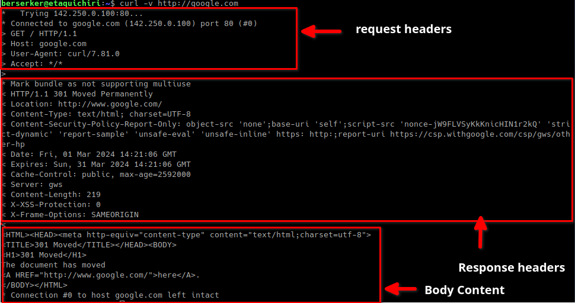

# Automation Tools

## CURL

command line tool and library for transferring data with URLs
(since 1998)

> https://curl.se

> Command example

We need to open a commandline shell to use curl

store token temporally, in Windows Systems use set or setx
> Linux:
```shell
export token=xxxxxxxxxxxxxxxxxxx
```
> Windows:
```shell
set token=xxxxxxxxxxxxxxxxxxx
```
### GET

GET the **projects** 

Default call from page
```shell
curl -X GET https://api.todoist.com/rest/v2/projects -H "Authorization: Bearer $token"
```

GET without GET option
```shell
curl https://api.todoist.com/rest/v2/projects -H "Authorization: Bearer $token"
```

output to file
```shell
curl https://api.todoist.com/rest/v2/projects -H "Authorization: Bearer $token" -o output.json
```

See the details of response
```shell
curl "https://api.todoist.com/rest/v2/projects" -H "Authorization: Bearer $token" -v
```
Get a project by Id

```shell
curl "https://api.todoist.com/rest/v2/projects/$id_project" \
  -H "Authorization: Bearer $token"
```

### POST
Create a project
```shell
curl "https://api.todoist.com/rest/v2/projects" -X POST \
    --data '{ "name": "Shopping List" }' \
    -H "Content-Type: application/json" \    
    -H "Authorization: Bearer $token"
```
create project using file
```shell
curl "https://api.todoist.com/rest/v2/projects" -X POST \
    --data @data.json \ 
    -H "Content-Type: application/json"  
    -H "Authorization: Bearer $token"
```
> content of data.json file
 
```json
{
  "name": "Shopping List"
}
```
### UPDATE
Update project 
```shell
curl "https://api.todoist.com/rest/v2/projects/$id_project" \
    -X POST \
    --data '{ "name": "Things To Buy" }' \
    -H "Content-Type: application/json" \    
    -H "Authorization: Bearer $token"
```
** Try using PUT and PATCH

### DELETE
Delete a project

```shell
curl -X DELETE "https://api.todoist.com/rest/v2/projects/$id_project" \
    -H "Authorization: Bearer $token"
```

## Postman

Postman is an API platform for building and using APIs. Postman simplifies each step of the API lifecycle and streamlines collaboration,
so you can create better APIs—faster.

https://www.postman.com/

## Insomnia

Kong Insomnia is a collaborative open source API development platform that makes it easy to build high-quality APIs — without the bloat and clutter of other tools.

https://insomnia.rest

## Task:
> Create CURL request using an API:
> 
> Basic CRUD(Read, Create, Update, Delete):
> 
> Negative cases at least 4:
> 
> Save in curl folder in your repository:
> 
<pre>
 ├── api_automation_2024
 │  ├── docs
 │  ├── curl --> upload your request here
</pre>

## References:

> curl: https://curl.se 

> curl download: https://curl.se/download.html

> headers: https://en.wikipedia.org/wiki/List_of_HTTP_header_fields
