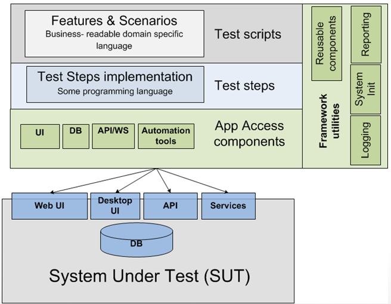

## Framework Basic Architecture


The test architect role has gained importance because of automation. Automation is the key area in modern testing. The
test architecture of automation depends on the framework type you choose.

Document the checklist and standards that are necessary to maintain while writing the codes.
Define the automation execution strategy.

## Automation Strategy

- Platform or operating system and its version
- Frequency of Sanity, Smoke, and regression tests
- Suite level execution
- Executing different types of tests such as Integration, API, and End to end tests
- Integration with DevOps such as Continuous Integration(CI)/Continuous Delivery (CD) pipelines
- Test reporting and analysis

## API Testing Methodology
1. Phase 0. Smoke Tests (endpoints working)
2. Phase 1. Acceptance Tests (CRUD)
3. Phase 2. Functional/Non-Functional Tests (Variety of inputs, negative, boundaries, etc. | Performance, Concurrency, Security, etc.)
4. Phase 3. Client Tests (Common flows, E2E, etc.)

## Folder Structures

The **“flat layout”** refers to organising a project’s files in a folder or repository, such that the various configuration
files and import packages are all in the top-level directory

<pre>
├── README.md
├── noxfile.py
├── pyproject.toml
├── setup.py
├── awesome_package/
│   ├── __init__.py
│   └── module.py
└── tools/
    ├── generate_awesomeness.py
    └── decrease_world_suck.py
</pre>

The **“src layout”** deviates from the flat layout by moving the code that is intended to be importable (i.e. import
awesome_package, also known as import packages) into a subdirectory. This subdirectory is typically named src/, hence
“src layout”.

<pre>
├── README.md
├── noxfile.py
├── pyproject.toml
├── setup.py
├── src/
│    └── awesome_package/
│       ├── __init__.py
│       └── module.py
└── tools/
    ├── generate_awesomeness.py
    └── decrease_world_suck.py
</pre>

### Structure example
<pre style="color:yellow">
├── docs (documentation)
├── config (configuration files)
├── api/webservices
│ ├── endpoint 1
│ ├── endpoint 2
│ ├── .....
│ └── endpoint n
├── features (for BDD approach)
│ ├── feature 1
│ ├── feature 2
│ ├── .....
│ └── feature n
├── test_cases (if are using an specific library like robot framework)
├── logs
├── helpers
├── pylint_checkers
├── unittests
├── utils
├── ...
</pre>

## Helpers vs Utils

|              | Helper Functions/Classes                                         | Utility Functions/Classes                                                                  |
|--------------|------------------------------------------------------------------|--------------------------------------------------------------------------------------------|
| Purpose      | Provide support or aid to other parts of the program             | Perform common or generic operations that are not tied to any specific part of the program |
| Scope        | Typically used within a specific module or part of the program   | Can be used throughout the program or in multiple programs                                 |
| Dependencies | Often depend on other parts of the program or external libraries | Usually independent of other parts of the program                                          |
| Examples     |  Form validation functions, data formatting classes              | String manipulation functions, math libraries                                              |


## Setting Up API Automation with Python

Python is a popular and versatile programming language. Combining pytest, nose2 with Python allows for efficient and readable
test scripts, making
it a preferred choice for API test automation.

## Setup Environment

> create venv

```shell
python3.12 -m venv venv
```

> activate venv

```shell
venv/bin/activate
```

# References

> Layouts: https://packaging.python.org/en/latest/discussions/src-layout-vs-flat-layout/

> Test Architecture: https://blog.testproject.io/2020/06/29/design-patterns-in-test-automation/