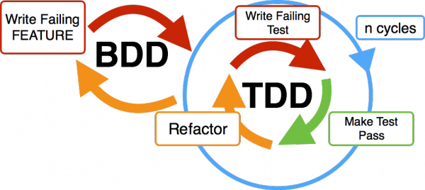
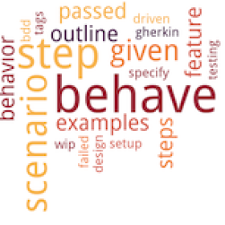
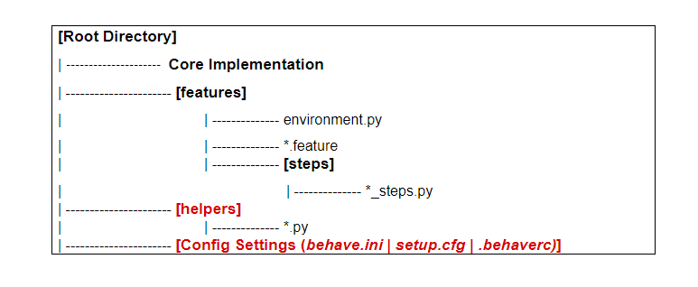

# Behavior Driven Development - Gherkin

**BDD** came to the fore when the test automation was proving too technical for non-technical team members and stakeholders. To improve the situation, a layer was introduced to add easy-to-understand English while the code would be at the backend.



## BDD Frameworks Python


| Framework      | Pros                                                                                                                                                                                                                                                                                                       | Cons |
|----------------|------------------------------------------------------------------------------------------------------------------------------------------------------------------------------------------------------------------------------------------------------------------------------------------------------------|------|
| **behave**     | <ul><li>It fully supports the Gherkin language.<li>Environmental functions and fixtures make setup and cleanup easy.<li>It has Django and Flask integrations.<li>It is popular with Python BDD practitioners.<li>Online docs and tutorials are great.<li>It has PyCharm Professional Edition support.</ul> | <ul><li>There’s no support for parallel execution.<li>behave-parallel, a spinoff framework, is needed.<li>It’s a standalone framework.<li>Sharing steps between feature files can be a bit of a hassle.</ul>    |
| **pytest-bdd** | <li>It is fully compatible with pytest and major pytest plugins.<li>It benefits from pytest‘s community, growth, and goodness.<li>Fixtures are a great way to manage context between steps.<li>Tests can be filtered and executed together with other pytest tests.<li>Step definitions and hooks are easily shared using conftest.py.<li>Tabular data can be handled better for data-driven testing.<li>Online docs and tutorials are great.<li>It has PyCharm Professional Edition support.                                                                                                                                                                                                                                                                                                           |<li>Step definition modules must have explicit declarations for feature files (via “@scenario” or the “scenarios” function).<li>Scenario outline steps must be parsed differently.|
| **radish**     |         <li>Gherkin language extensions empower testers to write better tests.<li>The website, docs, and logo are on point.<li>Feature files and step definitions come out very clean.                                                                                                                                                                                                                                                                                                   |<li>It’s a standalone framework with limited extensions.<li>BDD purists may not like the additions to the Gherkin syntax.|
| **lettuce**    |  <li>Its code is simpler.<li>It’s tried and true.                                                                                                                                                                                                                                                                                                          |<li>It lacks the feature richness of the other frameworks.<li>It doesn’t appear to have much active, ongoing support|
| **freshen**    | No longer mantained                                                                                                                                                                                                                                                                                        ||

## Behave

behave is one of the most popular Python BDD frameworks. Although it is not officially part of the Cucumber project, it functions very similarly to Cucumber frameworks.



## Implementation of Framework

* Project creation
* Create virtual environment
* Installation libraries
* Feature file creation (Gherkin)
* Creating the Configuration Settings (behave.ini | setup.cfg)
* Creating Helper Functions
* Creating environmental controls file (environment.py)
* Creating Step Definitions for each Scenario Step (python)
* Executions
* Reports



## Gherkin Format and Syntax

Gherkin files are plain text Files and have the extension .feature
A feature file can contain one or more scenarios. Relevant Tags (@Tag) are used to differentiate between different Scenarios

* **Feature**. Provides a high-level description of the software feature. 
* **Scenario**. Indicates the title of the test case.
* **Given**. Describes a set of pre-conditions for the Test automation scenario. 
* **When**. Describes the scenario steps
* **Then**. Describes the Scenario outcome, can be validations 
* **And, But (Steps)**, Used to provide additional steps
* **Background**
* **Scenario Outline**
* **""" (Doc Strings)**
* **| (Data Tables)**
* **@ (Tags)**
* **\# (Comments)**
* *

### Given:
Given step is used to describe the initial information of the system. Usually, it describes the prerequisites before a test case execution can start.
When cucumber runs a Given step, it configures the system to be in an already defined state, such as object configuration or adding required data to a test database.

The objective of Given step is to have the system in a known state before the user starts interacting with the When steps. It is good not to talk about user interaction in Given steps.

Given steps are the preconditions if you are creating the use cases. It is also valid and okay to have several Given steps if required.

**Examples:**

* Mike and Jack have started the game
* User is logged in
* User has a balance of $40

### When
Step written under When a keyword describes an event and an action. This can be a person or user interacting with the software/system. Also, it could be an event triggered by another or an external system.

It’s highly recommended that you have a single When step for one Scenario. If multiple when are needed, then splitting that kind of scenario into multiple scenarios is advised.

**Examples:**

* Click login button
* Invite a connection
* Withdraw money
* Declare a nominee

### Then
Step written under 'Then’ keyword is used to describe an expected result or an outcome.
The step definition of a Then step uses an assertion to match the actual outcome (Actual outcome of the When step) to the expected outcome about what the system is supposed to do.
The outcome of this step should be an observable output that is something like a report, message or user interface and not an internal behaviour of the system like a record inside a database.

**Examples:**

* See that the login was successful
* The nominee is declared or added
* Connection is invited

### And, But
When we have multiple steps for the one type of step like, for example 2 conditions that should be valid as a 
prerequisite, then after ‘Given’ the two steps can be separated by an ‘And’. Similarly, for ‘But’. 
These can be used with ‘Given’,’ When’ or ‘Then’ as needed. Using these keywords helps keep the documentation 
organized and increases readability by making it more structured.


### Background
Sometimes you may find that you are repeating the same Given steps in all of the scenarios in the feature.
Since they are repeated in each scenario, this is a sign that those steps are not essential to describe the scenarios. They are just the event details. We can move such Given steps to the background by grouping them all under a Background section.

### Scenario Outline
The keyword Scenario Outline executes the same scenario multiple times with different values.

For example, without scenario outline, passing multiple values to the same scenario as different cases increase the time and effort required in test case creation and execution, as can also be seen below:


## Benefits of Using Gherkin:
Using Gherkin language to write and define the behaviour in your BDD framework has many advantages. Some of the major ones are mentioned below:

1. Gherkin is simple
2. Increases code reusability 
3. Focuses on project requirements

## Disadvantages of Using Gherkin:
Every tool and software has limitations and disadvantages, and Gherkin is no different. Here are some of the cons of using Gherkin:

1. Not for all projects
2. Potential Expense
3. It requires a lot of engagement

## Feature Examples
### Feature template

```gherkin
@acceptance @projects @smoke
Feature: <title>
  
  In order to <do something>
  As a <user>
  I want to <achieve some goal>
  
  @tag_scenario
  Scenario: <title>
  
    <additional description>
  
    Given <some state>
    When <some action>
    Then <some expectation> with <some_name> # where <some_name> is actual Gherkin syntax for a table lookup!

    Examples:
      | some_name |
      | A         |
      | B         |
      | C         |
      | ...etc    |
```

```gherkin
Feature: Resilience

  In order to provide content to our users
  As an organisation
  We want our websites/apps and their dependencies to be available

  Scenario: Fastly Unavailable

    Fastly is our CDN provider, and is effectively the 'front door' to the
    majority of our publicly consumed content.

    Given Fastly is unavailable
    When a user requests a public buzzfeed resource (e.g. www.buzzfeed.com)
    Then we expect the resource to be provided
```

```gherkin
Feature: Restaurant

  Scenario Outline: eating

    Given there are <start> cucumbers
    When I eat <eat> cucumbers
    Then I should have <left> cucumbers

    Examples:
      | start | eat | left |
      |    12 |   5 |    7 |
      |    20 |   5 |   15 |
```

### References

https://www.lambdatest.com/blog/selenium-python-behave-tutorial-bdd/

https://automationpanda.com/2019/04/02/python-bdd-framework-comparison/

https://behave.readthedocs.io/en/latest/
