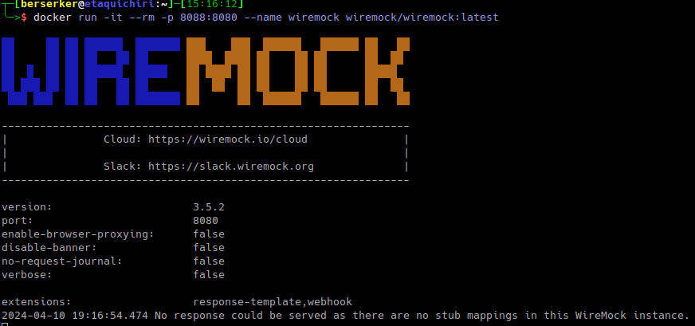

## Wiremock

Python WireMock is a library that allows users to interact with a WireMock instance from within a Python project.


## Stub
A stub is a controllable replacement for an Existing Dependency (or collaborator) in the system. By using a stub, you can test your code without dealing with the dependency directly

> download wiremock image

```shell
docker pull wiremock/wiremock:latest
```

> run wiremock
 
```shell
docker run -it --rm -p 8088:8088 --name wiremock wiremock/wiremock:latest
```

Example image after run the command



> go to URL: http://localhost:8088/__admin/swagger-ui/


## Wiremock client

To install:
```shell
pip install wiremock
```

To install with testing dependencies:
```shell
pip install wiremock[testing]
```


## References: 

https://wiremock.org/docs/solutions/python/
